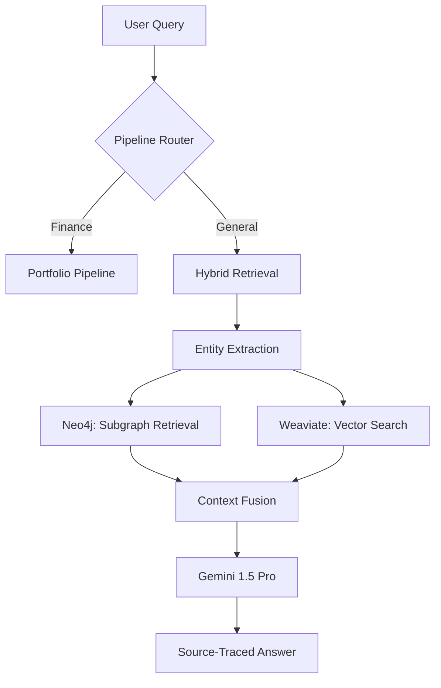
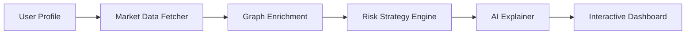

# DeepChain-Hybrid-RAG: Enterprise Knowledge Intelligence 🕸️🤖

DeepChain is an industry-level **Knowledge Graph + RAG hybrid system** designed for complex domains like Finance, Legal, and Healthcare. It leverages the structured context of **Neo4j** and the semantic power of **Weaviate** to provide highly faithful, source-traced, and transparent answers.

---

## 🚀 Key Features

- **Hybrid Fusion Retrieval**: Seamlessly combines Neo4j (structural relationships) with Weaviate (semantic vector chunks).
- **Dynamic Financial Pipeline**: A specialized module for **Personalized Portfolio Allocation** and **Trade Backtesting** using live market data (yfinance).
- **GraphRAG Architecture**: LLM-driven triplet extraction (Subject-Predicate-Object) for deep reasoning over connected data.
- **Self-Healing Strategy**: Built-in fallback mechanisms that maintain operational status even if graph databases are under heavy load.
- **Premium UI/UX**: High-performance React frontend with real-time financial health metrics and interactive risk-profile visualizations.

---

## 🏗️ System Architecture

### 1. Hybrid RAG Engine
The core engine balances two worlds: structural facts and semantic meaning.



### 2. Personalized Portfolio Pipeline
A multi-stage process that combines user persona data with live market trends.



---

## 🛠️ Tech Stack

- **Core**: Python 3.13, FastAPI, LangChain
- **LLM**: Google Gemini 1.5 Pro / Flash
- **Knowledge Graph**: Neo4j (Cypher)
- **Vector Store**: Weaviate
- **Frontend**: React (Vite), TailwindCSS, Recharts
- **Data**: yfinance, pandas

---

## ⚙️ Installation & Setup

### 1. Prerequisites
- Docker Desktop
- Node.js & npm
- Python 3.10+
- Google Gemini API Key

### 2. Infrastructure Setup
Spin up the database stack using Docker:
```powershell
docker-compose up -d
```
*Starts: Neo4j (7474), Weaviate (8080), MLflow (5000), Prometheus, and Grafana.*

### 3. Application Setup
```powershell
# Install Backend Dependencies
pip install -r requirements.txt

# Install Frontend Dependencies
cd frontend
npm install
```

---

## 🏗️ Execution

### Start the Backend
The backend includes memory optimizations for lower-end systems.
```powershell
$env:TF_ENABLE_ONEDNN_OPTS=0; python api/main.py
```

### Start the Frontend
```powershell
cd frontend
npm run dev
```

---

## 📊 Domain Coverage

| Domain | Knowledge Base | Retrieval Strategy |
| :--- | :--- | :--- |
| **Finance** | SEC Filings, Earnings, Market Data | GraphRAG + Live Fetching |
| **Health** | PubMed, Biomedical Graphs, ICD-10 | Multi-hop Traversal |
| **Legal** | Case Law, Statutes, Contract Corpus | Precedent-chain Mapping |
| **Mental** | DSM-5, PsycINFO, Comorbidity Graph | Comorbidity Reasoning |

---

## 📄 License
MIT License - 2026 DeepChain Team
